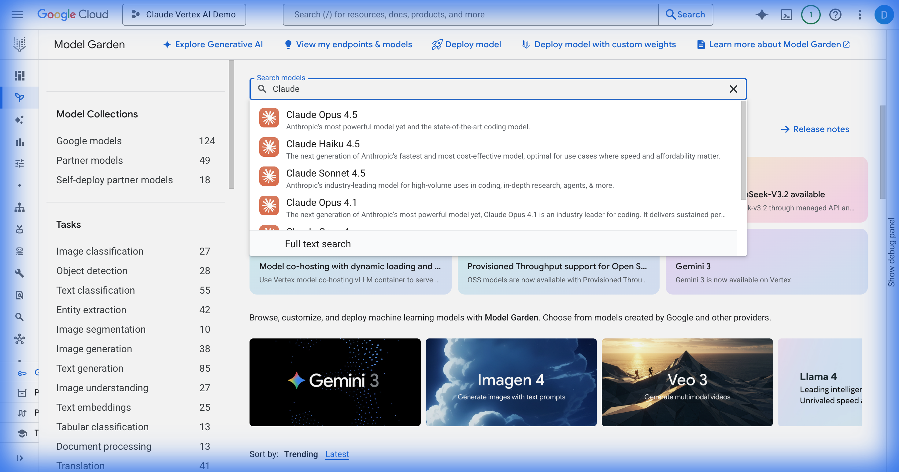
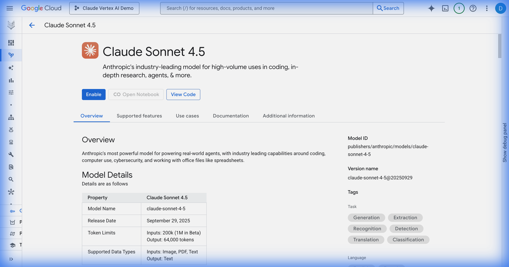
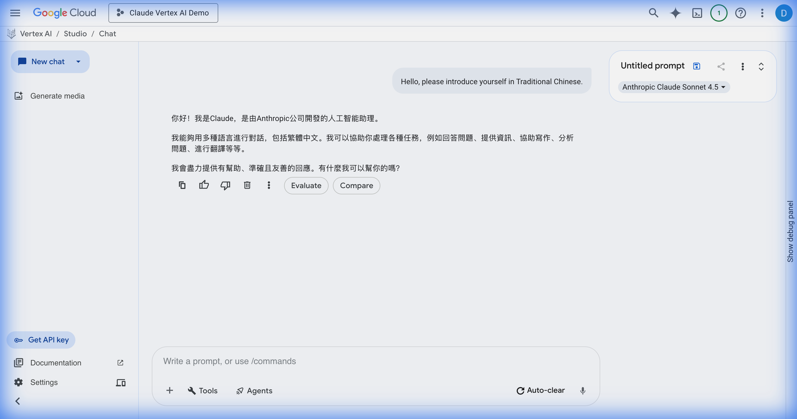

# Claude on Vertex AI 使用教學

本專案提供在 Google Cloud Vertex AI 上使用 Anthropic Claude 模型的完整教學。

## 🎬 示範影片

### Model Garden 導航
展示如何在 Vertex AI Model Garden 中搜尋和查看 Claude 模型：


### Claude 模型啟用
完整的 Claude Sonnet 4.5 啟用流程：


## 📸 操作截圖

### 在 Model Garden 搜尋 Claude


### Claude Sonnet 4.5 模型詳情


### Vertex AI Studio 測試結果
Claude 成功以繁體中文回應：



## 📋 快速開始

### 前置條件
- Google Cloud 帳戶
- 已啟用帳單的 GCP 專案
- Vertex AI API 已啟用

### 步驟

1. **進入 Model Garden**
   ```
   https://console.cloud.google.com/vertex-ai/model-garden
   ```

2. **搜尋 Claude**
   - 在搜尋欄輸入 "Claude"
   - 選擇需要的模型（如 Claude Sonnet 4.5）

3. **啟用模型**
   - 點擊 "Enable" 按鈕
   - 填寫業務資訊表單
   - 同意服務條款

4. **在 Vertex AI Studio 測試**
   - 導航至 Vertex AI Studio
   - 選擇 Claude 模型
   - 開始對話

## 🔗 相關連結

- [Vertex AI 官方文件](https://cloud.google.com/vertex-ai/docs)
- [Anthropic Claude 文件](https://docs.anthropic.com/)
- [Model Garden](https://cloud.google.com/vertex-ai/docs/model-garden/explore-models)

## 📄 授權

MIT License
